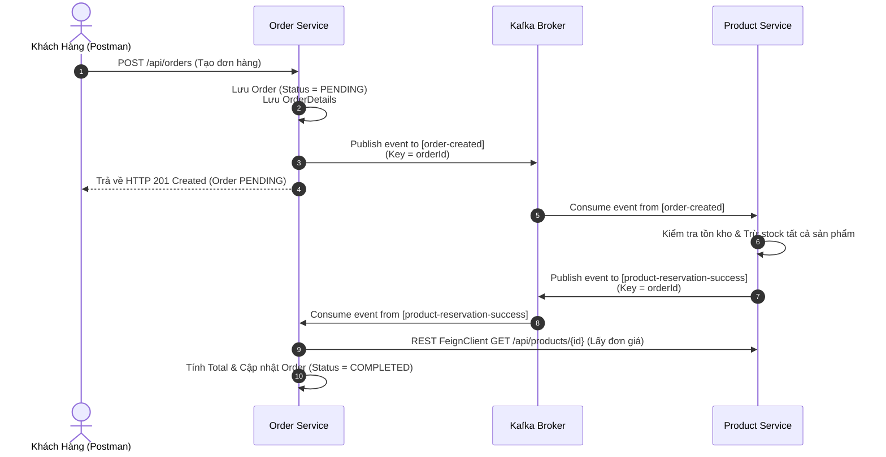
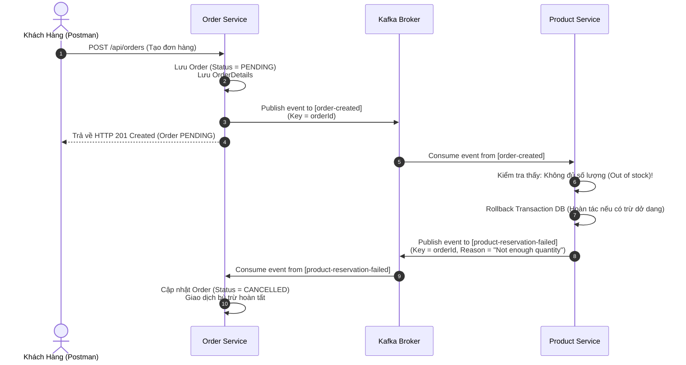

# Kiến Trúc Saga Choreography Với Apache Kafka & Spring Boot

Dự án mẫu triển khai mô hình **Saga Choreography** để quản lý giao dịch phân tán (Distributed Transaction) giữa các Microservices sử dụng **Apache Kafka** làm Message Broker, **Spring Boot**, **Spring Cloud (Eureka)**, và **MySQL**.

---

## 📑 Mục Lục
1. [Tổng Quan Về Saga Choreography Pattern](#1-tổng-quan-về-saga-choreography-pattern)
2. [Các Thuật Ngữ Cốt Lõi Trong Apache Kafka](#2-các-thuật-ngữ-cốt-lõi-trong-apache-kafka)
3. [Thiết Kế Hệ Thống (Topics, Events, Producers, Consumers, Partitions)](#3-thiết-kế-hệ-thống)
4. [Sơ Đồ Luồng Hoạt Động (Flow Diagrams)](#4-sơ-đồ-luồng-hoạt-động)
5. [Hướng Dẫn Cấu Hình Kafka Chi Tiết Cho Từng Service](#5-hướng-dẫn-cấu-hình-kafka-chi-tiết)
6. [Chi Tiết Xử Lý Giao Dịch & Bù Trừ (Compensating Transaction)](#6-chi-tiết-xử-lý-giao-dịch--bù-trừ)
7. [Hướng Dẫn Chạy & Kiểm Thử Dự Án](#7-hướng-dẫn-chạy--kiểm-thử-dự-án)

---

## 1. Tổng Quan Về Saga Choreography Pattern

Trong kiến trúc Microservices, mỗi service sở hữu cơ sở dữ liệu riêng (**Database-per-Service**). Khi một quy trình nghiệp vụ yêu cầu cập nhật dữ liệu trên nhiều service (ví dụ: Tạo đơn hàng -> Trừ kho -> Thanh toán), việc sử dụng ACID Transaction truyền thống qua 2PC (Two-Phase Commit) sẽ gây nghẽn hiệu năng và tạo điểm lỗi đơn lẻ.

**Saga Pattern** chia giao dịch lớn thành một chuỗi các giao dịch cục bộ (Local Transactions) tại từng service:
* Mỗi local transaction cập nhật DB của chính service đó.
* Sau khi hoàn tất, service bắn ra một sự kiện (Domain Event).
* Service tiếp theo lắng nghe sự kiện đó và thực hiện transaction cục bộ của mình.
* Nếu một bước thất bại, Saga sẽ kích hoạt **giao dịch bù trừ (Compensating Transactions)** theo chiều ngược lại để hoàn tác dữ liệu đã thay đổi trước đó.

### Đặc điểm của Choreography (Biên đạo múa):
* **Không có Coordinator / Orchestrator trung tâm**: Các service tự lắng nghe sự kiện của nhau và tự quyết định hành động tiếp theo.
* **Loose Coupling (Khớp nối lỏng)**: Giảm phụ thuộc trực tiếp giữa các service qua REST API đồng bộ, tăng khả năng mở rộng.

---

## 2. Các Thuật Ngữ Cốt Lõi Trong Apache Kafka

| Thuật ngữ | Tiếng Anh | Giải thích chi tiết |
| :--- | :--- | :--- |
| **Broker** | Kafka Broker | Máy chủ Kafka nhận, lưu trữ và chuyển tiếp messages. Một cụm (Cluster) gồm nhiều Broker. |
| **Topic** | Topic | Kênh hoặc danh mục logic dùng để phân loại và lưu trữ messages (tương tự như một bảng trong DB). |
| **Partition** | Partition | Một Topic được chia nhỏ thành nhiều Partition vật lý để xử lý song song và tăng thông lượng (Throughput). Dữ liệu trong 1 partition được đảm bảo thứ tự tuyệt đối. |
| **Producer** | Producer | Ứng dụng/Service gửi (publish) messages/events lên các Kafka Topics. |
| **Consumer** | Consumer | Ứng dụng/Service đăng ký (subscribe) và đọc (consume) messages từ các Kafka Topics. |
| **Consumer Group** | Consumer Group | Tập hợp các Consumer cùng hợp tác để đọc dữ liệu từ một Topic. Mỗi Partition chỉ được đọc bởi duy nhất 1 Consumer trong cùng 1 Group tại 1 thời điểm (Load balancing). |
| **Offset** | Offset | Số nguyên tự tăng định danh duy nhất vị trí của từng message trong một Partition, giúp Consumer biết nó đã đọc tới đâu. |
| **Key & Value** | Message Key / Value | - **Key**: Dùng để xác định partition mà message sẽ được ghi vào (cùng Key sẽ luôn vào cùng Partition).<br>- **Value**: Nội dung payload của sự kiện (thường là JSON, Avro, Protobuf). |
| **Serializer** | Serializer | Chuyển đổi Java Object thành byte array (`byte[]`) để gửi qua mạng. |
| **Deserializer** | Deserializer | Chuyển đổi chuỗi byte nhận từ Kafka trở lại thành Java Object. |
| **Idempotence** | Idempotent Consumer | Đảm bảo việc nhận và xử lý lại cùng một sự kiện nhiều lần (do mạng chập chờn / retry) không làm sai lệch dữ liệu. |

---

## 3. Thiết Kế Hệ Thống

### 3.1. Danh Sách Topics & Events

| STT | Tên Topic | Mô tả sự kiện | Producer | Consumer | Payload Event DTO |
| :---: | :--- | :--- | :---: | :---: | :--- |
| **1** | `order-created` | Đơn hàng được tạo ở trạng thái `PENDING` | `order-service` | `product-service` | `OrderEventKafka` (orderId, list items) |
| **2** | `product-reservation-success` | Trừ kho thành công toàn bộ sản phẩm | `product-service` | `order-service` | `OrderEventKafka` / `ProductReservationSuccess` |
| **3** | `product-reservation-failed` | Trừ kho thất bại (hết hàng, sai ID) | `product-service` | `order-service` | `ProductReservationFailedEvent` (orderId, reason) |

### 3.2. Cấu Trúc Partition & Message Key

* **Message Key**: Trong toàn bộ luồng Saga, `orderId.toString()` được chọn làm **Message Key**.
* **Ý nghĩa kiến trúc**:
  * Đảm bảo mọi sự kiện liên quan đến cùng một `orderId` (tạo đơn, giữ kho thành công, hoặc giữ kho thất bại) luôn được đẩy vào **cùng một Partition** theo thứ tự thời gian.
  * Giúp Consumer xử lý tuần tự chính xác, loại bỏ nguy cơ Race Condition.

### 3.3. Consumer Groups

* `order-service`: Thuộc group `order-group`.
* `product-service`: Thuộc group `product-group`.
* *Lưu ý*: Hai service bắt buộc phải có `group-id` khác nhau để không cạnh tranh phân chia partition của nhau.

---

## 4. Sơ Đồ Luồng Hoạt Động (Flow Diagrams)

### 4.1. Kịch Bản Thành Công (Happy Path - Success)



---

### 4.2. Kịch Bản Thất Bại & Bù Trừ (Compensating / Rollback Path)



---

## 5. Hướng Dẫn Cấu Hình Kafka Chi Tiết

### 5.1. Cấu Hình Tại `order-service`

#### File: `order-service/src/main/resources/application.yaml`
```yaml
server:
  port: 8081

spring:
  application:
    name: order-service
  kafka:
    bootstrap-servers: localhost:9092
    producer:
      key-serializer: org.apache.kafka.common.serialization.StringSerializer
      value-serializer: org.springframework.kafka.support.serializer.JsonSerializer
    consumer:
      auto-offset-reset: earliest
      group-id: order-group
      key-deserializer: org.apache.kafka.common.serialization.StringDeserializer
      value-deserializer: org.springframework.kafka.support.serializer.JsonDeserializer
      properties:
        spring.json.trusted.packages: "*"
        spring.json.use.type.headers: false

  datasource:
    driver-class-name: com.mysql.cj.jdbc.Driver
    url: jdbc:mysql://localhost:3306/order_database?createDatabaseIfNotExist=true
    username: root
    password: your_mysql_password
  jpa:
    hibernate:
      ddl-auto: update

eureka:
  client:
    service-url:
      defaultZone: http://localhost:8761/eureka/
```

---

### 5.2. Cấu Hình Tại `product-service`

#### File: `product-service/src/main/resources/application.yaml`
```yaml
server:
  port: 8082

spring:
  application:
    name: product-service
  kafka:
    bootstrap-servers: localhost:9092
    producer:
      key-serializer: org.apache.kafka.common.serialization.StringSerializer
      value-serializer: org.springframework.kafka.support.serializer.JsonSerializer
    consumer:
      auto-offset-reset: earliest
      group-id: product-group
      key-deserializer: org.apache.kafka.common.serialization.StringDeserializer
      value-deserializer: org.springframework.kafka.support.serializer.JsonDeserializer
      properties:
        spring.json.trusted.packages: "*"
        spring.json.use.type.headers: false

  datasource:
    driver-class-name: com.mysql.cj.jdbc.Driver
    url: jdbc:mysql://localhost:3306/product_database?createDatabaseIfNotExist=true
    username: root
    password: your_mysql_password
  jpa:
    hibernate:
      ddl-auto: update

eureka:
  client:
    service-url:
      defaultZone: http://localhost:8761/eureka/
```

> **Ghi chú quan trọng về 2 thuộc tính cấu hình:**
> 1. `spring.json.trusted.packages: "*"`: Cho phép Spring Kafka deserialize JSON thành Object mà không bị chặn bởi cơ chế bảo mật package.
> 2. `spring.json.use.type.headers: false`: Ngăn Kafka JsonSerializer nhúng thông tin package Java gốc (`__TypeId__`) vào Header của message. Điều này giúp hai service ở hai package Java khác nhau vẫn parse được cùng cấu trúc JSON sang DTO nội bộ của mình.

---

## 6. Chi Tiết Xử Lý Giao Dịch & Bù Trừ

### 6.1. Xử Lý Phía `product-service` ([ProductService.java](file:///D:/microservice-rikkei/session14/practice-choreography/product-service/src/main/java/com/nttho/productservice/service/ProductService.java))

```java
@Service
@RequiredArgsConstructor
public class ProductService {
    private final KafkaTemplate<String, Object> kafkaTemplate;
    private final ProductRepository productRepository;

    @KafkaListener(topics = "order-created")
    @Transactional
    public void handleOrderCreate(OrderEventKafka orderEventKafka) {
        try {
            for (OrderDetailKafka detail : orderEventKafka.getOrderDetailKafkas()) {
                Product product = productRepository.findById(detail.getProductId())
                        .orElseThrow(() -> new RuntimeException("Product not found: " + detail.getProductId()));
                
                if (product.getStock() < detail.getQuantity()) {
                    throw new RuntimeException("Not enough quantity");
                }
                product.setStock(product.getStock() - detail.getQuantity());
                productRepository.save(product);
            }

            // Gửi event thành công sau khi toàn bộ items hợp lệ
            kafkaTemplate.send(
                    "product-reservation-success",
                    orderEventKafka.getOrderId().toString(),
                    orderEventKafka
            );
        } catch (Exception e) {
            // Đánh dấu rollback DB để hoàn tác nếu có cập nhật dở dang
            TransactionAspectSupport.currentTransactionStatus().setRollbackOnly();

            ProductReservationFailedEvent failedEvent = ProductReservationFailedEvent.builder()
                    .orderId(orderEventKafka.getOrderId())
                    .reason(e.getMessage())
                    .build();

            // Gửi event thất bại để kích hoạt luồng bù trừ (Compensation)
            kafkaTemplate.send(
                    "product-reservation-failed",
                    orderEventKafka.getOrderId().toString(),
                    failedEvent
            );
        }
    }
}
```

### 6.2. Xử Lý Phía `order-service` ([OrderService.java](file:///D:/microservice-rikkei/session14/practice-choreography/order-service/src/main/java/com/nttho/orderservice/service/OrderService.java))

```java
@Service
@RequiredArgsConstructor
public class OrderService {
    private final OrderRepository orderRepository;
    private final ProductClient productClient;
    private final OrderDetailRepository orderDetailRepository;
    private final KafkaTemplate<String, OrderEventKafka> kafkaTemplate;

    // Lắng nghe sự kiện thành công -> chuyển COMPLETED và tính tổng tiền
    @KafkaListener(topics = "product-reservation-success")
    @Transactional
    public void handleProductReservationSuccess(OrderEventKafka productReservation) {
        Order order = orderRepository.findById(productReservation.getOrderId()).orElseThrow();
        order.setOrderStatus(OrderStatus.COMPLETED);

        double total = 0.0;
        List<OrderDetail> orderDetails = orderDetailRepository.findAllByOrder(order);
        for (OrderDetail orderDetail : orderDetails) {
            ProductDto productDto = productClient.findById(orderDetail.getProductId());
            orderDetail.setUnitPrice(productDto.getPrice());
            orderDetailRepository.save(orderDetail);
            total += productDto.getPrice() * orderDetail.getQuantity();
        }
        order.setTotal(total);
        orderRepository.save(order);
    }

    // Lắng nghe sự kiện thất bại -> chuyển CANCELLED (Giao dịch bù trừ)
    @KafkaListener(topics = "product-reservation-failed")
    @Transactional
    public void handleProductReservationFailed(ProductReservationFailedEvent failedEvent) {
        Order order = orderRepository.findById(failedEvent.getOrderId()).orElseThrow();
        order.setOrderStatus(OrderStatus.CANCELLED);
        orderRepository.save(order);
    }
}
```

---

## 7. Hướng Dẫn Chạy & Kiểm Thử Dự Án

### 7.1. Khởi Động Hệ Thống

1. **Khởi động Zookeeper & Kafka Broker** (Port `9092`).
2. **Khởi động Discovery Server** (`discovery-server` - Port `8761`).
3. **Khởi động Product Service** (`product-service` - Port `8082`).
4. **Khởi động Order Service** (`order-service` - Port `8081`).

---

### 7.2. Kịch Bản Kiểm Thử (Test Cases)

#### Bước 1: Khởi tạo sản phẩm mẫu
* **POST** `http://localhost:8082/api/products`
* Header: `Content-Type: application/json`
* Request Body:
  ```json
  {
    "name": "MacBook Pro M3",
    "stock": 10,
    "price": 45000000
  }
  ```

---

#### Bước 2: Test Luồng Thành Công (Success Path)
* **POST** `http://localhost:8081/api/orders`
* Request Body (Mua 2 chiếc):
  ```json
  {
    "customerName": "Nguyen Van A",
    "orderDetailRequests": [
      {
        "productId": 1,
        "quantity": 2
      }
    ]
  }
  ```
* **Kiểm tra kết quả**:
  * **GET** `http://localhost:8081/api/orders/1`: `orderStatus` là `COMPLETED`, `total` là `90000000`.
  * **GET** `http://localhost:8082/api/products/1`: `stock` giảm từ `10` xuống còn `8`.

---

#### Bước 3: Test Luồng Thất Bại & Rollback (Compensation Path)
* **POST** `http://localhost:8081/api/orders`
* Request Body (Mua vượt tồn kho - ví dụ 50 chiếc):
  ```json
  {
    "customerName": "Le Van B",
    "orderDetailRequests": [
      {
        "productId": 1,
        "quantity": 50
      }
    ]
  }
  ```
* **Kiểm tra kết quả**:
  * **GET** `http://localhost:8081/api/orders/2`: `orderStatus` tự động chuyển sang `CANCELLED`.
  * **GET** `http://localhost:8082/api/products/1`: `stock` vẫn giữ nguyên là `8` (không bị trừ).
