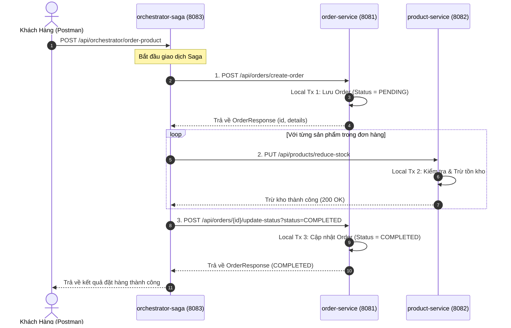
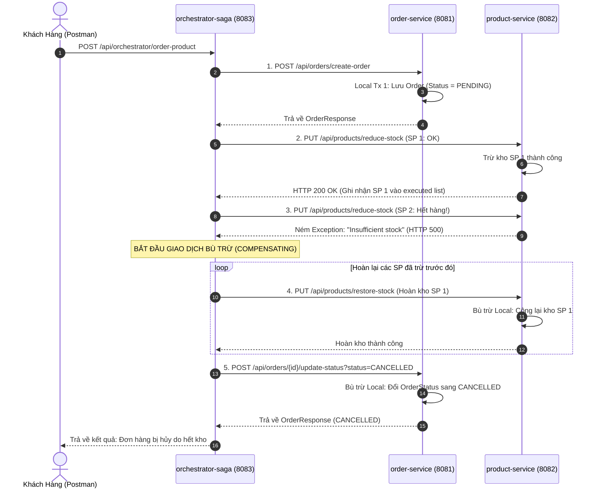

# Kiến Trúc Saga Orchestrator Với Spring Cloud & OpenFeign

Dự án mẫu triển khai mô hình **Saga Orchestrator** (Điều phối tập trung) để quản lý giao dịch phân tán (**Distributed Transaction**) giữa các Microservices sử dụng **Spring Boot**, **Spring Cloud (Eureka Server, OpenFeign)**, và **MySQL**.

---

## 📑 Mục Lục
1. [Tổng Quan Về Saga Orchestrator Pattern](#1-tổng-quan-về-saga-orchestrator-pattern)
2. [Giải Thích Các Thuật Ngữ Cốt Lõi](#2-giải-thích-các-thuật-ngữ-cốt-lõi)
   - [Distributed Transaction (Giao dịch phân tán)](#21-distributed-transaction-giao-dịch-phân-tán)
   - [Local Transaction (Giao dịch cục bộ)](#22-local-transaction-giao-dịch-cục-bộ)
   - [Compensating Transaction (Giao dịch bù trừ / Xử lý ngược)](#23-compensating-transaction-giao-dịch-bù-trừ--xử-lý-ngược)
   - [So sánh Orchestration vs Choreography](#24-so-sánh-orchestration-vs-choreography)
   - [Idempotency & Retryability](#25-idempotency--retryability)
3. [Kiến Trúc & Thiết Kế Hệ Thống](#3-kiến-trúc--thiết-kế-hệ-thống)
4. [Sơ Đồ Luồng Hoạt Động (Sequence Flow Diagrams)](#4-sơ-đồ-luồng-hoạt-động)
5. [Hướng Dẫn Cấu Hình Chi Tiết Từng Service](#5-hướng-dẫn-cấu-hình-chi-tiết-từng-service)
6. [Chi Tiết Xử Lý Điều Phối & Bù Trừ Trong Mã Nguồn](#6-chi-tiết-xử-lý-điều-phối--bù-trừ-trong-mã-nguồn)
7. [Hướng Dẫn Khởi Động & Kịch Bản Kiểm Thử (Test Cases)](#7-hướng-dẫn-khởi-động--kịch-bản-kiểm-thử)

---

## 1. Tổng Quan Về Saga Orchestrator Pattern

Trong kiến trúc Microservices, mỗi service sở hữu cơ sở dữ liệu riêng biệt (**Database-per-Service**). Khi một quy trình nghiệp vụ yêu cầu cập nhật dữ liệu trên nhiều service (ví dụ: Tạo đơn hàng -> Trừ kho -> Thanh toán), ta không thể dùng `@Transactional` ACID truyền thống của một database đơn lẻ.

**Saga Orchestrator** giải quyết bài toán này bằng cách:
* Sử dụng một service trung tâm (**Orchestrator**) đóng vai trò như một **"Nhạc trưởng"**.
* Orchestrator trực tiếp gửi các lệnh (Command) tới từng service thành phần theo một kịch bản định sẵn thông qua REST/OpenFeign hoặc Message Broker.
* Nhận phản hồi từ từng bước để quyết định:
  * Tiếp tục gọi bước kế tiếp nếu thành công.
  * Kích hoạt chuỗi các hành động **bù trừ (Compensating Transactions)** theo chiều ngược lại nếu xảy ra lỗi.

```
       [ Client ]
           │
           ▼
┌──────────────────────┐
│  Orchestrator Saga   │ ──(1. Tạo Order)──────► [ Order Service ] (DB: order_database2)
│   (Port: 8083)       │
│                      │ ──(2. Trừ/Hoàn Kho)───► [ Product Service ] (DB: product_database2)
└──────────────────────┘
```

---

## 2. Giải Thích Các Thuật Ngữ Cốt Lõi

### 2.1. Distributed Transaction (Giao dịch phân tán)
* **Khái niệm**: Là một giao dịch duy nhất về mặt nghiệp vụ nhưng bao gồm nhiều thao tác ghi/đọc dữ liệu nằm trên **nhiều cơ sở dữ liệu vật lý khác nhau** hoặc nhiều service khác nhau.
* **Thách thức**: Không thể áp dụng Two-Phase Commit (2PC) hay ACID thông thường vì gây khóa tài nguyên (blocking), giảm thông lượng nghiêm trọng và tăng nguy cơ Single Point of Failure (SPOF).

---

### 2.2. Local Transaction (Giao dịch cục bộ)
* **Khái niệm**: Là một transaction ACID thông thường được thực thi và cam kết (commit) **hoàn toàn bên trong phạm vi 1 service và 1 database riêng lẻ**.
* **Ví dụ trong dự án**:
  1. `order-service` lưu một bản ghi Order vào bảng `orders` của `order_database2` với trạng thái `PENDING` $\rightarrow$ Đây là **Local Transaction 1**.
  2. `product-service` thực hiện cập nhật `stock = stock - quantity` trong bảng `products` của `product_database2` $\rightarrow$ Đây là **Local Transaction 2**.
* **Đặc tính**: Mỗi Local Transaction độc lập, tự commit dữ liệu vào DB của mình ngay khi hoàn thành bước đó mà không cần chờ toàn bộ quy trình kết thúc.

---

### 2.3. Compensating Transaction (Giao dịch bù trừ / Xử lý ngược)
* **Khái niệm**: Vì các Local Transaction trước đó đã **commit** vào cơ sở dữ liệu, ta **không thể thực hiện rollback vật lý (`ROLLBACK;` trong SQL)** được nữa. Do đó, ta phải thực thi một giao dịch mới nhằm **nghịch đảo (hoàn tác theo logic nghiệp vụ)** những tác động mà giao dịch trước đã gây ra.
* **Tại sao gọi là "Xử lý dữ liệu ngược"?**
  * Hành động thuận: `reduceStock(product_id, 2)` (Kho: $10 \rightarrow 8$).
  * Hành động bù trừ (ngược lại): `restoreStock(product_id, 2)` (Kho: $8 \rightarrow 10$).
  * Hành động thuận: `createOrder` (Status: `PENDING`).
  * Hành động bù trừ: `updateStatus(order_id, CANCELLED)`.
* **Quy tắc bù trừ**:
  * Luồng bù trừ được thực hiện theo **thứ tự ngược lại (LIFO - Last In First Out)** so với các bước đã thực hiện thành công.
  * Giao dịch bù trừ **phải luôn thành công** (hoặc được retry cho đến khi thành công), không được phép sinh thêm lỗi bù trừ khác.

---

### 2.4. So sánh Orchestration vs Choreography

| Tiêu chí | Saga Orchestrator (Dự án này) | Saga Choreography |
| :--- | :--- | :--- |
| **Cơ chế điều phối** | **Tập trung (Centralized)**: Có 1 service Orchestrator điều khiển toàn bộ luồng. | **Phân tán (Decentralized)**: Các service tự lắng nghe và bắn Event qua Message Broker (Kafka/RabbitMQ). |
| **Giao tiếp** | Thường dùng REST API / OpenFeign đồng bộ (hoặc Command-driven). | Bất đồng bộ qua Event (Event-Driven). |
| **Khả năng kiểm soát** | Rất dễ theo dõi, debug và nắm bắt trạng thái toàn bộ luồng nghiệp vụ tại một nơi. | Khó theo dõi toàn cảnh (dễ rơi vào mê cung sự kiện - "Event Hell"). |
| **Mức độ phụ thuộc** | Khớp nối chặt hơn (Orchestrator phụ thuộc vào API của các service con). | Khớp nối lỏng (Loose Coupling), các service không biết đến sự tồn tại của nhau. |
| **Phù hợp cho** | Quy trình phức tạp, nhiều bước, cần quản lý trạng thái tập trung và dễ bảo trì. | Hệ thống quy mô lớn, nhiều service độc lập cao, ưu tiên thông lượng cực cao. |

---

### 2.5. Idempotency & Retryability
* **Idempotency (Tính bất biến khi gọi lại)**: Một API có tính idempotent nghĩa là gọi API đó 1 lần hay $N$ lần với cùng tham số thì trạng thái dữ liệu kết quả vẫn như nhau (ví dụ: API chuyển trạng thái sang `CANCELLED`).
* **Retryable Transaction**: Trong trường hợp mạng chập chờn, Orchestrator có thể gọi lại (retry) một bước cho đến khi thành công mà không gây sai lệch dữ liệu.

---

## 3. Kiến Trúc & Thiết Kế Hệ Thống

### 3.1. Danh Sách Các Services

| Service Name | Port | Database | Vai trò trong hệ thống |
| :--- | :---: | :--- | :--- |
| `discovery-server` | `8761` | None | Netflix Eureka Server quản lý service registry & discovery. |
| `orchestrator-saga` | `8083` | None | Nhạc trưởng nhận request từ Client, gọi FeignClient điều phối luồng Saga & bù trừ. |
| `order-service` | `8081` | `order_database2` | Quản lý đơn hàng (tạo đơn `PENDING`, cập nhật trạng thái `COMPLETED`/`CANCELLED`). |
| `product-service` | `8082` | `product_database2` | Quản lý thông tin và tồn kho sản phẩm (trừ kho `reduceStock`, hoàn kho `restoreStock`). |

---

## 4. Sơ Đồ Luồng Hoạt Động

### 4.1. Kịch Bản Thành Công (Happy Path)



---

### 4.2. Kịch Bản Thất Bại & Kích Hoạt Bù Trừ (Compensating Flow)



---

## 5. Hướng Dẫn Cấu Hình Chi Tiết Từng Service

### 5.1. Cấu Hình `discovery-server`
* **File**: `discovery-server/src/main/resources/application.yaml`
```yaml
server:
  port: 8761

spring:
  application:
    name: discovery-server

eureka:
  client:
    register-with-eureka: false
    fetch-registry: false
```

---

### 5.2. Cấu Hình `product-service`
* **File**: `product-service/src/main/resources/application.yaml`
```yaml
server:
  port: 8082

spring:
  application:
    name: product-service
  datasource:
    driver-class-name: com.mysql.cj.jdbc.Driver
    url: jdbc:mysql://localhost:3306/product_database2?createDatabaseIfNotExist=true
    username: root
    password: your_mysql_password
  jpa:
    hibernate:
      ddl-auto: update

eureka:
  client:
    fetch-registry: true
    register-with-eureka: true
    service-url:
      defaultZone: http://localhost:8761/eureka
```

---

### 5.3. Cấu Hình `order-service`
* **File**: `order-service/src/main/resources/application.yaml`
```yaml
server:
  port: 8081

spring:
  application:
    name: order-service
  datasource:
    driver-class-name: com.mysql.cj.jdbc.Driver
    url: jdbc:mysql://localhost:3306/order_database2?createDatabaseIfNotExist=true
    username: root
    password: your_mysql_password
  jpa:
    hibernate:
      ddl-auto: update

eureka:
  client:
    fetch-registry: true
    register-with-eureka: true
    service-url:
      defaultZone: http://localhost:8761/eureka
```

---

### 5.4. Cấu Hình `orchestrator-saga`
* **File**: `orchestrator-saga/src/main/resources/application.yaml`
```yaml
server:
  port: 8083

spring:
  application:
    name: orchestrator-saga

eureka:
  client:
    fetch-registry: true
    register-with-eureka: true
    service-url:
      defaultZone: http://localhost:8761/eureka
```

---

## 6. Chi Tiết Xử Lý Điều Phối & Bù Trừ Trong Mã Nguồn

### 6.1. Feign Clients tại `orchestrator-saga`

#### `ProductClient.java`:
```java
@FeignClient(name = "product-service", path = "/api/products")
public interface ProductClient {
    // Hành động thuận (Trừ kho)
    @PutMapping("/reduce-stock")
    void reduceStock(@RequestBody ProductStockCommand request);

    // Hành động bù trừ (Hoàn kho)
    @PutMapping("/restore-stock")
    void compensatingProduct(@RequestBody ProductStockCommand request);
}
```

#### `OrderClient.java`:
```java
@FeignClient(name = "order-service", path = "/api/orders")
public interface OrderClient {
    @PostMapping("/create-order")
    OrderResponse createOrder(@RequestBody OrderRequest request);

    @PostMapping("/{id}/update-status")
    OrderResponse updateOrder(@PathVariable("id") Long id, @RequestParam(name = "status") OrderStatus status);
}
```

---

### 6.2. Thuật Toán Điều Phối Tại `OrchestratorService.java`

```java
@Service
@RequiredArgsConstructor
@Slf4j
public class OrchestratorService {
    private final OrderClient orderClient;
    private final ProductClient productClient;

    public OrderResponse orderProduct(OrderRequest orderRequest) {
        // Danh sách lưu lại những sản phẩm đã trừ kho thành công để hoàn tác nếu bước sau bị lỗi
        List<ProductStockCommand> executedProducts = new ArrayList<>();
        
        // Bước 1: Tạo Order với trạng thái PENDING
        OrderResponse orderResponse = orderClient.createOrder(orderRequest);

        try {
            // Bước 2: Duyệt từng sản phẩm và thực hiện trừ kho
            for (OrderDetail detail : orderResponse.getOrderDetails()) {
                ProductStockCommand command = new ProductStockCommand(detail.getProductId(), detail.getQuantity());
                productClient.reduceStock(command);
                executedProducts.add(command); // Ghi nhận đã trừ kho thành công
            }

            // Bước 3: Tất cả sản phẩm đều hợp lệ -> Cập nhật đơn hàng COMPLETED
            return orderClient.updateOrder(orderResponse.getId(), OrderStatus.COMPLETED);
            
        } catch (Exception e) {
            log.error("Saga Error: {}. Kích hoạt giao dịch bù trừ...", e.getMessage());

            // Giao dịch bù trừ 1: Hoàn trả số lượng tồn kho cho các sản phẩm đã trừ trước đó
            for (ProductStockCommand command : executedProducts) {
                try {
                    productClient.compensatingProduct(command);
                } catch (Exception ex) {
                    log.error("Lỗi hoàn kho cho SP {}: {}", command.getId(), ex.getMessage());
                }
            }

            // Giao dịch bù trừ 2: Cập nhật trạng thái đơn hàng sang CANCELLED
            return orderClient.updateOrder(orderResponse.getId(), OrderStatus.CANCELLED);
        }
    }
}
```

---

## 7. Hướng Dẫn Khởi Động & Kịch Bản Kiểm Thử

### 7.1. Thứ Tự Khởi Động Các Service
Khởi động lần lượt 4 ứng dụng theo đúng thứ tự:
1. `DiscoveryServerApplication` (Port `8761`)
2. `ProductServiceApplication` (Port `8082`) *(Sẽ tự động chèn 5 sản phẩm mẫu vào DB)*
3. `OrderServiceApplication` (Port `8081`)
4. `OrchestratorSagaApplication` (Port `8083`)

---

### 7.2. Dữ Liệu Sản Phẩm Mẫu Có Sẵn Trong Database

| ID | Tên sản phẩm | Số lượng kho ban đầu (`stock`) | Giá (`price`) |
| :---: | :--- | :---: | :---: |
| **1** | iPhone 15 Pro Max | **10** | $1200.0 |
| **2** | Samsung Galaxy S24 Ultra | **15** | $1100.0 |
| **3** | MacBook Pro M3 | **5** | $2000.0 |
| **4** | AirPods Pro 2 | **20** | $250.0 |
| **5** | Chuột Logitech MX Master 3S | **2** | $100.0 |

---

### 7.3. Kịch Bản Kiểm Thử (Test Cases)

#### 🧪 Test Case 1: Đặt hàng thành công (`COMPLETED`)
* **Endpoint**: `POST http://localhost:8083/api/orchestrator/order-product`
* **Header**: `Content-Type: application/json`
* **Body**:
```json
{
  "customerName": "Nguyen Van A",
  "orderDetailRequests": [
    {
      "productId": 1,
      "quantity": 2
    },
    {
      "productId": 4,
      "quantity": 1
    }
  ]
}
```
* **Kết quả kiểm tra**:
  * Trả về HTTP 200 với `orderStatus: "COMPLETED"`.
  * Kiểm tra API `GET http://localhost:8082/api/products/1`: `stock` giảm từ $10 \rightarrow 8$.
  * Kiểm tra API `GET http://localhost:8082/api/products/4`: `stock` giảm từ $20 \rightarrow 19$.

---

#### 🧪 Test Case 2: Đặt hàng thất bại & Bù trừ Rollback (`CANCELLED`)
Thử đặt 2 chiếc SP 1 (hợp lệ) và 10 chiếc SP 5 (vượt quá số lượng kho vì SP 5 chỉ có 2 cái):
* **Endpoint**: `POST http://localhost:8083/api/orchestrator/order-product`
* **Header**: `Content-Type: application/json`
* **Body**:
```json
{
  "customerName": "Tran Thi B",
  "orderDetailRequests": [
    {
      "productId": 1,
      "quantity": 2
    },
    {
      "productId": 5,
      "quantity": 10
    }
  ]
}
```
* **Kết quả kiểm tra**:
  * Trừ SP 1 thành công $\rightarrow$ Trừ SP 5 ném lỗi hết hàng $\rightarrow$ Orchestrator gọi API `restore-stock` bù trừ cho SP 1 $\rightarrow$ Đổi Order sang `CANCELLED`.
  * Trả về HTTP 200 với `orderStatus: "CANCELLED"`.
  * Kiểm tra API `GET http://localhost:8082/api/products/1`: `stock` vẫn giữ nguyên là `8` (đã được hoàn tác bù trừ chính xác).
